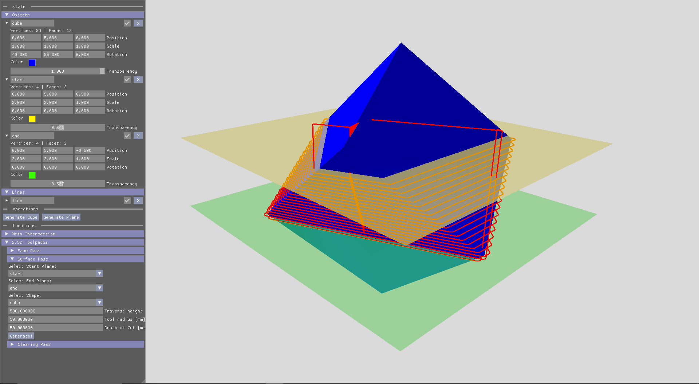
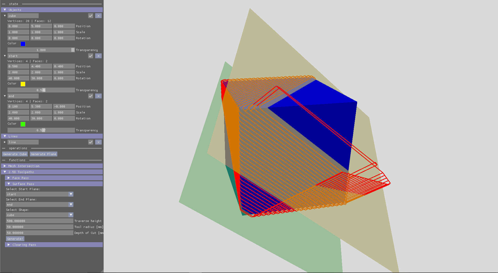
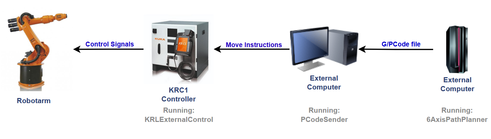

<!-- Improved compatibility of back to top link: See: https://github.com/othneildrew/Best-README-Template/pull/73 -->
<a id="readme-top"></a>
<!--
*** Thanks for checking out the Best-README-Template. If you have a suggestion
*** that would make this better, please fork the repo and create a pull request
*** or simply open an issue with the tag "enhancement".
*** Don't forget to give the project a star!
*** Thanks again! Now go create something AMAZING! :D
-->

<!-- ABOUT THE PROJECT -->
## About The Project

This project is concerned with calculation of 6+ axis toolpaths for large robotarms. The original aim was to mill large foam molds with a KR125. This repository contains separate code for the pathplanning, robot controller and external PC. It is mostly set up for my specific situtation, i.e. an (old) KRC1 controller, KR125 arm, used for milling mesh-based shapes. See below for some example outputs. For now this focusses on 'mesh' based geometries. I.e. it operates on large triangle-based geometries, in contrast to the standard within CAD programs where geometries are defined by the geometric operations that produced it. This has some crucial limitations, like the algorithm speed and the viability of some ease-of-use functionalities, but allows for a wider range of geometries to be used. 




<!-- GETTING STARTED -->
## Getting Started
### Dependencies

Though CMake should handle (most) dependencies, for the sake of completeness here are the external sources that are used. 

For the graphics:
* Vulkan
* glfw
* glm
* imgui
* implot

For file importing:
* stbImage
* tinyObjLoader
* native file dialog

For math:
* Eigen
* proxsuite

Additionally, large chunks of the following repositories have been copied and modified to fit specific path planning needs:
* https://github.com/intents-software/mesh-plane-intersection/tree/master
* https://github.com/jbuckmccready/CavalierContours

### Installation

1. Clone the repository.
   ```sh
   git clone https://github.com/IvoBlok/6AxisPathPlanner.git
   ```
2. Create a build directory.
   ```sh
   cd 6AxisPathPlanner
   mkdir build
   ```
3. Compile the path planner using your prefered compiler.
   ```sh
   cd build
   cmake ../
   cmake --build .
   ```
   The resulting executable is located in `build/Debug/`.
   
4. Compile the PCodeSender using g++ (on some linux variant).
   ```sh
   cd resources
   g++ -g -o PCodeSender PCodeSender.cpp
   ```
5. Transfer `KRLExternalControl.src` to the robot controller. Either by copying it line by line (safest), inserting some external media into the controller, or removing the primary harddrive and copying the file over in some external system (risky). The controller itself compiles the KRL code when needed. 


<!-- USAGE EXAMPLES -->
## Usage

This repository contains the path planner, which can be compiled using the instructions above. It also contains, within the resources folder, the code that is running on the Kuka robot controller and on the external computer sending the instructions. See the overview below for their relations. 


Use the 6AxisPathPlanner executable to create your toolpaths. Then export these paths to a PCode (personal dumb version of GCode) .txt file. Transfer this file to the machine that will run PCodeSender. This machine is connected to the KRC1 controller by a 'standard' serial connection. The rather obscure 3964R serial protocol is used, due to the limited support of the controller. The controller requires some wacky settings to be modified to accept the communication. See the (pirated) controller documentation for this. 

Start PCodeSender with the supplied PCode text file, which awaits untill the controller requests move instructions. Then start the KRLExternalControl on the robot. Both programs should exit when the last instructions have been sent/moved.


<!-- TO DO -->
## To Do

- [ ] Add IK null-space optimization
- [ ] Add movement animation
- [ ] Add full 3D polylines
- [ ] Fix transparency
- [ ] Add non-planar pathing
- [ ] Add collision control for path validation
- [ ] Update CMakeFile to create a release executable with proper Eigen (and proxsuite) optimization
- [ ] Split off computational code into separate threads

<!-- IDEAS -->
## Ideas

Regarding the inverse kinematics, currently it has a few potential improvements. If the initial joint state leads to a near-zero gradient, the numerical limitations make that exactly zero, and hence the program thinks it is in a (local) minimum. This could be avoided by either using a warm start, or doing SQP for (multiple) random starting joint states, then taking the one with the lowest local cost. This is probably smart regardless, to find the global minimum more reliably. If we say the cost function will not have extra parameters for the redundancy problem, we can say with confidence that, as long as the goal is in reach, the cost at the end should be 0.0. Hence we can use this to either do more iterations with modified initial positions, or say that it is out of reach.
There is also the thing of redundancy. If there are more degrees of freedom for the robot then those set for the goal, there is likely a set of joint states that all achieve the optimal cost. This could be resolved by adding terms to the cost function, but that might influence things for non-redundant configurations. Something called null-space projection seems advisable, since it adds a secondary separate optimization step after a redundant optimal joint state has been found.

To keep note, one 'future works' idea might be to integrate collisions into the path planning; A given path potentially has 1+ extra degrees of freedom to play with in terms of orientation for a 6/7D robotarm. By defining some theoretical function that is maximized if a collision occurs, we might be able to apply a minimization problem to get the optimal values for the free degrees of freedom to avoid collision / exceeding the joint limits.


<!-- LICENSE -->
## License

You're ofcourse free to use this code in any noncommercial way you want, though crediting the sources I did is probably appropriate. Tadie License section!


<!-- CONTACT -->
## Contact

Ivo Blok - ivoblokdoorn@gmail.com

Project Link: [https://github.com/IvoBlok/6AxisPathPlanner](https://github.com/IvoBlok/6AxisPathPlanner)
